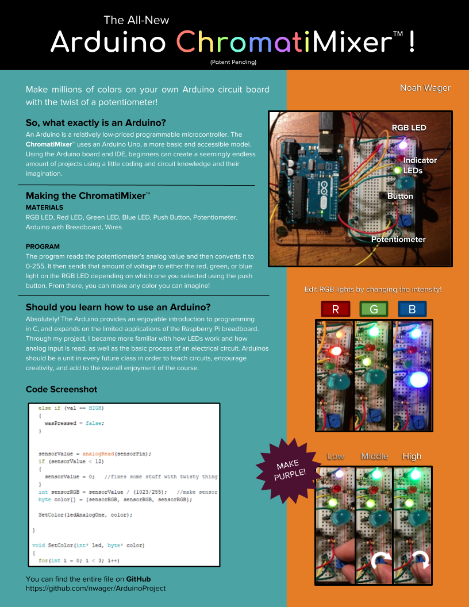

# ArduinoProject - Noah Wager
Repository for my high school Arduino project and poster.

Using an Arduino Uno, I created a program that changes the red, green, and blue outputs of an LED using input from a twistable potentiometer.

Poster:

